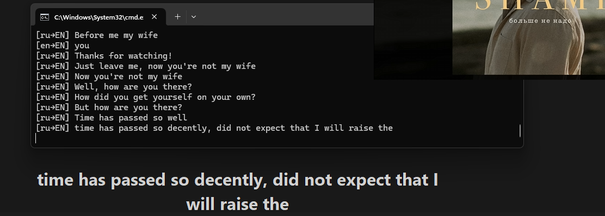

# Live System Audio Transcription with Overlay

This project allows you to transcribe **system audio in real-time** using [**Faster-Whisper**](https://github.com/SYSTRAN/faster-whisper) and display it in a **modern, draggable overlay**. You can optionally save the transcript to a text file and translate to English.



## Features

- Live transcription of system audio via Stereo Mix / loopback.
- Optional translation to English (`--translate`).
- Live overlay at the bottom center of the screen.
- Transparent and draggable overlay.
- Optional transcript saving (`--save` and `--output`).
- Works with Faster-Whisper model on GPU (CUDA recommended).
- **Lite version**: console-only output with no arguments (`live_transcription_lite.py`).

## Requirements

- Python 3.10+  
- GPU with CUDA for optimal performance (optional but recommended)  

## Installation

This section provides a quick setup to get started with the project.

1. **Clone or download the repository**
```bash
git clone https://github.com/Pazran/live-audio-transcription.git
cd live-audio-transcription
```

2. **Create and activate a virtual environment**
```bash
python -m venv venv
# Windows
venv\Scripts\activate
# macOS/Linux
source venv/bin/activate
```

3. **Install dependencies**
```bash
pip install -r requirements.txt
```

4. **Download Faster-Whisper medium model**
- Place it under `_models/faster-whisper-medium`

5. **Run the script**
```bash
python live_transcription.py
```

## Usage

### Run with overlay
```bash
python live_transcription.py
```

### Translate to English
```bash
python live_transcription.py --translate
```

### Save transcript to default file
```bash
python live_transcription.py --save
```

### Save transcript to a specific file
```bash
python live_transcription.py --save --output my_transcript.txt
```

### Disable overlay (console-only output)
```bash
python live_transcription.py --no-overlay
```

### Translate + save + disable overlay
```bash
python live_transcription.py --translate --save --no-overlay
```

### Lite console-only version
```bash
python live_transcription_lite.py
```
- No arguments, prints live transcription to console only. Default to EN

## Notes

- Ensure **Stereo Mix** or your system audio loopback device is enabled.  
- Overlay defaults to **center-bottom of the screen**.  
- Use `Ctrl+C` in the console to stop transcription.  

## Folder Structure

```
project/
│
├─ live_transcription.py         # Main script with overlay and optional saving
├─ live_transcription_lite.py    # Console-only version
├─ requirements.txt
├─ README.md
└─ _models/                      # Faster-Whisper model files
```

## Model

- Faster-Whisper medium model recommended (`int8` for GPU efficiency).  
- Model path can be updated in `live_transcription.py` and `live_transcription_lite.py`:

```python
model_path = r"_models\faster-whisper-medium"
```

## Useful Links

- [Faster-Whisper GitHub](https://github.com/SYSTRAN/faster-whisper)
- [Python Documentation](https://docs.python.org/3/)

